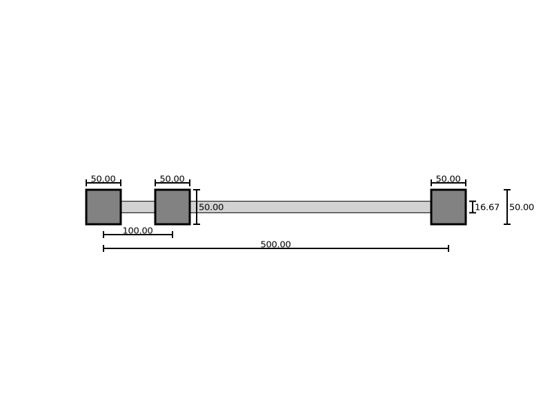
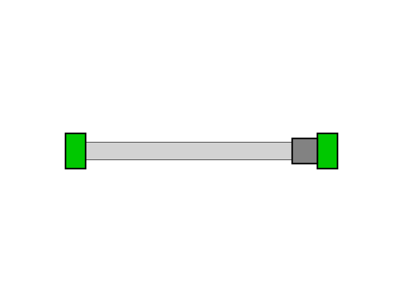

# Tecniche di Programmazione Avanzata - Homework1: realizzazione di una guida prismatica

Lo scopo del progetto è quello di creare una guida prismatica che può scorrere su una rotaia fissata ai suoi estremi da due cerniere.

L'idea è di rendere facile la codifica con un'inizializzazione che prevede un numero minimo di parametri, tuttavia la libreria permette una modifica più avanzata sia tramite funzioni apposite, sia tramite menù interattivi da linea di comando.

Un esempio di prima guida prismatica ottenuta da un'inizializzazione semplice può essere osservata come segue (il rendering è ottenuto e commentato nel [_minimal working example_](mwe.cpp))

## Feature della libreria

La libreria è pensata per facilitare l'implementazione della guida prismatica nei rendering cercando di aggiustare automaticamente parametri in ingresso potenzialmente scorretti sia dal punto di vista logico (dimensioni negative), sia dal punto di vista geometrico (per esempio la guida non potrà mai sovrapporsi alle cerniere, e dunque valori del parametro di corsa che porterebbero a queste situazioni verrebbe opportunamente corretto).

E' possibile trovare una descrizione di tutte le funzioni accessibili e il loro funzionamento (con parametri in ingresso e valori in uscita) nella [**documentazione**](libreries/README.md) rilasciata.

## _Minimal Working Example_
Ai fini di capire velocemente il funzionamento della libreria e apprendere ad eseguire le operazioni base in maniera corretta è fornito un [_minimal working example_](mwe.cpp) (in segui mwe).

Nel documento viene mostrato come realizzare la guida prismatica mostrata in testa al documento e come, tramite la modifica delle proprietà  dello stesso cilindro, ottenere il seguente risultato:

