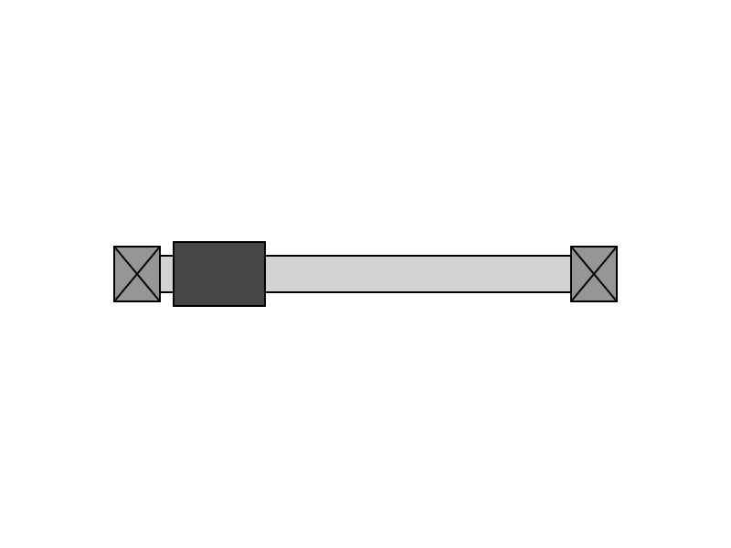

# Tecniche di Programmazione Avanzata - Homework 1

This repository contains my code for the first homework __crazy machines__ of _Tecniche di Programmazione Avanzata_ couse from the _Università degli studi di Trento_.

This new version is coded using che c++ class coding tecniques.

# Device: Prismatic Joint
My device is a __prismatic joint__, as shown in the next figure, that consist in a prism (dark grey rectangle) that can slide on a cylinder (white wide rectangle); the structor is anchored to other parts by two supports (crossed rectangle).

## Constructors

The library has implemented the class `PrismaticJoint`, set under the namespace `matteodv99tn`, where all the function that are going to be describe must be applied to. This class has implemented 2 main constructors:
- `PrismaticJoint(float x, float y, float len, float str)` that creates a prismatic joint centered in position _(x,y)_ with a length (measured from the center of the two supports) equal to `len`; `str` rappresent the stroke in percentual of the prism. All other geometric dimension are fixed but can be changed by other functions.

- `PrismaticJoint(const string file_name, const int index = 0)` that create a prismatic joint object by parsing a svg file called `file_name` (the string has to be without extension!). `index`, that by default is set to 0, rappresent the index of the prismatic joint to parse if the file contains more than 1 prismatic joint.

## Setter functions
The library presents a lot of setter function that, as the name describe, are use to set different parameters of the prismatic joint.
- `set_support_color`, `set_prism_color` and `set_cylinder_color` are 3 function that requires as input a 3 dimensional `int` vector containing the RGB value of the color;
- the functions `set_support_dimension` and `set_prism_prism` requires the input of the new `width` and `height` of the support/prism;
-other function with only 1 parameters are: `set_stroke` (set the stroke percentage), `set_cylinder_dimension()`, `set_length()`.

## SVG codes
To get the svg code and export a file it's used that same function `to_svg` that's overloaded:
- `to_svg(bool draw_annotation = false)` is the function that return a vector of string of the svg code related to the prismatic joint; by setting `draw_annotation` to `true` in the image the dimensions of the component will be shown;
- `to_svg(string file_name, bool draw_annotation)` is the function that saves the prismatic joint in the specified file (`file_name` should not have the extension .svg).